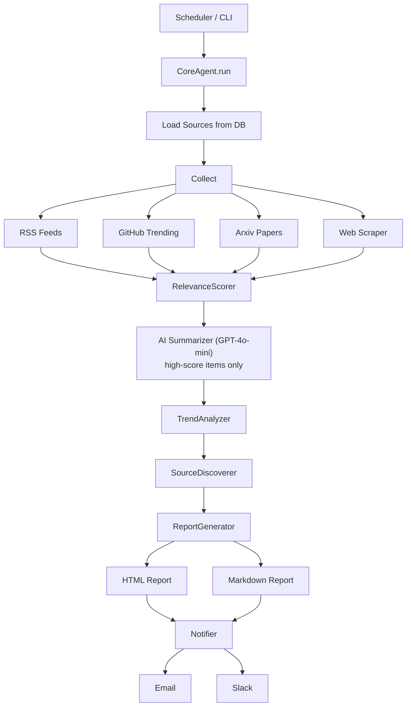

# PM Intelligence Agent

[](https://github.com/royavrahami/pm-intelligence-agent/actions/workflows/agent.yml)
[](LICENSE)
[](https://python.org)

An autonomous agent that continuously monitors the **Project Management, Program Management,
Agile, Engineering Leadership, and Strategy** landscape — then delivers structured, actionable
intelligence reports tailored for **Project Managers**, **Program Managers**, and
**Tech Leads** in the high-tech industry.

---

## Tech Stack

| Layer | Technology |
|---|---|
| **Language** | Python 3.11+ |
| **LLM** | OpenAI GPT-4o-mini |
| **Database** | SQLAlchemy ORM — SQLite (local) or PostgreSQL (production) |
| **Scheduling** | APScheduler |
| **Config** | pydantic-settings + `.env` |
| **Notifications** | SMTP (email) + Slack Web API |
| **Containerisation** | Docker + Docker Compose |
| **Testing** | pytest + pytest-cov |

---

## What It Does

| Capability              | Details                                                                                                                              |
| ----------------------- | ------------------------------------------------------------------------------------------------------------------------------------ |
| **Web intelligence**    | Polls 30+ curated RSS feeds, GitHub Trending, Arxiv papers, and web sources every 6 hours                                            |
| **AI-powered analysis** | Uses OpenAI GPT-4o-mini to summarise every article and extract PM-specific insights                                                  |
| **Trend detection**     | Clusters articles into trends, calculates momentum scores, and raises alerts for rapidly accelerating themes                         |
| **Self-expansion**      | Discovers new information sources autonomously by mining article pages for RSS feeds and querying the LLM for recommendations        |
| **Rich reports**        | Generates HTML + Markdown reports organised by category, relevance score, trend landscape                                           |
| **Notifications**       | Sends alerts via Email (SMTP) and Slack when high-momentum PM trends are detected                                                   |

---

## Quick Start

### Windows

```bat
setup.bat       :: creates .venv, installs deps, creates run.bat
run.bat run     :: first run
```

> **Windows note:** `run.bat` sets `PYTHONNOUSERSITE=1` to prevent
> Windows Store Python stubs from shadowing venv packages.

### Linux / macOS

### 1. Clone and configure

```bash
cd pm-intelligence-agent
cp .env.example .env
# Edit .env and set at minimum: OPENAI_API_KEY=sk-...
```

### 2. Install dependencies

```bash
python -m venv .venv
source .venv/bin/activate
pip install -r requirements.txt
```

### 3. Run once (test it works)

```bash
python main.py run
```

### 4. Start the scheduler (runs every 6 hours)

```bash
python main.py schedule
```

### 5. View reports

Reports are saved to `./reports/` as HTML files. Open in any browser.

---

## CLI Commands

```bash
python main.py run                   # Single run and exit
python main.py schedule              # Start recurring scheduler
python main.py schedule --interval 3 # Override interval (hours)
python main.py digest                # Run end-of-day digest
python main.py digest --hours 48     # Digest for the last 48 hours
python main.py report                # Generate report from existing data
python main.py status                # Show run history
python main.py sources               # List all registered sources
```

---

## Docker Deployment

```bash
cp .env.example .env     # Fill in OPENAI_API_KEY
docker compose up -d     # Start in background
docker compose logs -f   # Watch logs

# One-shot run (useful in CI pipelines)
docker compose --profile run-once up pm-agent-run-once
```

---

## Configuration

All settings are via environment variables (`.env` file):

| Variable                  | Default            | Description                                                |
| ------------------------- | ------------------ | ---------------------------------------------------------- |
| OPENAI_API_KEY            | **required**       | OpenAI API key                                             |
| OPENAI_MODEL              | gpt-4o             | Model for summarisation and trend analysis                 |
| OPENAI_MAX_TOKENS         | 2000               | Max tokens per summarisation call (600 truncates output)   |
| GITHUB_TOKEN              | optional           | GitHub PAT (raises API rate limit from 60 → 5000 req/hr)  |
| SCHEDULE_INTERVAL_HOURS   | 6                  | How often the agent runs                                   |
| MIN_RELEVANCE_SCORE       | 55                 | Minimum score (0–100) to include an article in reports     |
| NOTIFY_EMAIL              | optional           | Email address for alert notifications                      |
| SLACK_BOT_TOKEN           | optional           | Slack bot token for channel notifications                  |
| SLACK_CHANNEL             | #pm-intelligence   | Slack channel to post to                                   |

---

## Report Structure

Each generated report contains:

1. **Executive Stats** – Articles collected, trends detected, alerts count
2. **🚨 Alerts** – Trends requiring immediate attention (momentum ≥ threshold)
3. **⭐ Top 10 Articles** – Highest relevance score, with AI summary + PM insights
4. **📂 Articles by Category** – All articles grouped by: Project Management, Program Management,
   Agile & Scrum, Engineering Leadership, Strategy & OKRs, AI for PM, PM Tools
5. **📈 Trend Landscape** – All detected trends with momentum bars and descriptions

---

## Monitored Sources (default)

| Category              | Sources                                                                              |
| --------------------- | ------------------------------------------------------------------------------------ |
| Project Management    | PMI Blog, InfoQ PM, Agile Alliance                                                   |
| Program Management    | SAFe Blog, InfoQ Agile, Medium – Program Management                                  |
| Agile & Scrum         | Scrum.org Blog, Mountain Goat Software (Mike Cohn), Martin Fowler, Medium – Agile   |
| Engineering Leadership| The Pragmatic Engineer, LeadDev, Will Larson, First Round Review, Lenny's Newsletter|
| Strategy & OKRs       | Mind the Product, ProductPlan Blog, Roman Pichler Blog                               |
| Tools & GitHub        | Atlassian Blog, GitHub Blog, GitHub Trending, Dev.to – Management                   |
| Academic              | Arxiv (AI in PM, Agile Research, Effort Estimation, Technical Debt)                  |

New sources are **discovered automatically** every run and added to the database.

---

## Architecture

```
pm-intelligence-agent/
├── src/
│   ├── agent/           # CoreAgent orchestrator, TrendAnalyzer, SourceDiscoverer, DailyDigestAgent
│   ├── collectors/      # RSS, GitHub, Arxiv, Web scrapers
│   ├── processors/      # RelevanceScorer, Summarizer, ContentProcessor, KeywordExtractor
│   ├── storage/         # SQLAlchemy models + repositories (SQLite/PostgreSQL)
│   ├── reports/         # HTML/Markdown report generator + daily digest generator
│   ├── notifications/   # Email (SMTP) + Slack notifier
│   ├── scheduler/       # APScheduler wrapper
│   └── config/          # Settings (pydantic-settings) + sources.yaml
├── tests/               # Pytest suite (one class per file)
├── reports/             # Generated HTML reports
├── data/                # SQLite database
└── main.py              # CLI entry point
```

### Execution Cycle



---

## Running Tests

```bash
pytest                        # Run all tests with coverage
pytest -m "not integration"   # Skip tests that need network
pytest tests/test_storage/    # Run a specific module
```

### Example Test Output

```
========================= test session starts ==========================
platform linux -- Python 3.11.9, pytest-8.3.2
collected 44 items

tests/test_collectors/test_rss_collector.py ........              [  18%]
tests/test_processors/test_relevance_scorer.py ..........         [  40%]
tests/test_processors/test_summarizer.py ....                     [  49%]
tests/test_storage/test_article_repository.py ..............      [  81%]
tests/test_agent/test_trend_analyzer.py ........                  [  99%]
tests/test_notifications/test_notifier.py .                       [100%]

---------- coverage: platform linux, python 3.11.9 -----------
TOTAL                                                        85%

==================== 44 passed in 5.91s ====================
```

---

## Adding New Sources

**Option A – Edit `src/config/sources.yaml`:**

```yaml
rss_feeds:
  - name: "New PM Blog"
    url: "https://newpmblog.com/feed"
    category: "project_management"
    relevance_boost: 10
```

**Option B – The agent will discover them automatically** based on article links and LLM recommendations.

---

## Relationship to QA Intelligence Agent

This agent follows the same architecture as the `qa-intelligence-agent` in this repository.
Both agents share identical infrastructure patterns (storage, collectors, scheduler, notifications)
but differ in:

| Aspect | QA Intelligence Agent | PM Intelligence Agent |
|---|---|---|
| Focus | GenAI, AI agents, QA & testing | Project/Program Management, Agile, Leadership |
| Sources | Testing blogs, AI labs, DevOps | PMI, Agile Alliance, LeadDev, Pragmatic Engineer |
| Keywords | LLM testing, QA automation, playwright | OKR, Scrum, SAFe, risk management, roadmap |
| Summarizer | QA Manager perspective | Project/Program Manager perspective |
| Categories | genai, agents, qa_testing, devops | project_management, program_management, agile, leadership, strategy |

---

## Limitations & Next Steps

**Current limitations:**
- Report generation requires an active OpenAI API key (no offline fallback)
- Source discovery quality depends on GPT responses — occasionally suggests irrelevant feeds
- No deduplication across very similar articles from different sources

**Planned improvements:**
- [ ] Web UI dashboard (replace static HTML reports)
- [ ] Vector-based semantic deduplication
- [ ] Support for additional LLM providers (Anthropic Claude, Gemini)
- [ ] Slack slash-command to trigger on-demand reports
- [ ] Multi-workspace configuration (one agent, multiple topic profiles)

---

## License

MIT
